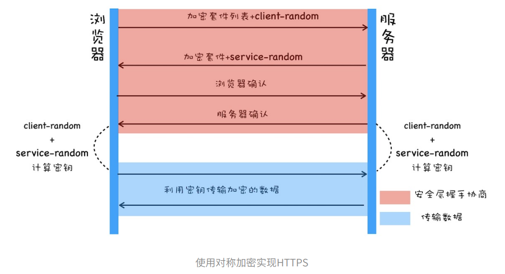
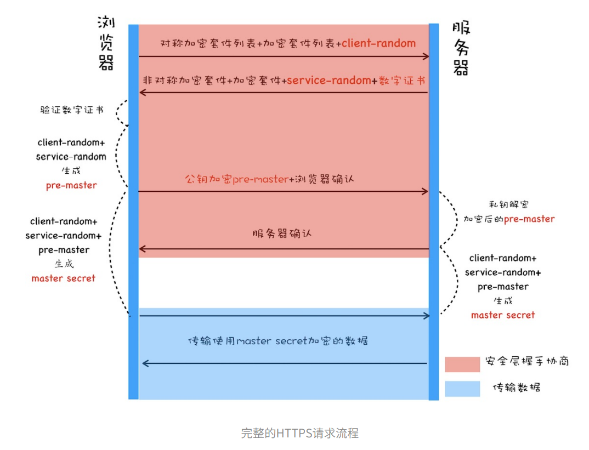

# HTTPS
`HTTP`是明文传输，因此在传输的每一个环节，数据都有可能被第三方窃取和篡改，HTTP数据经过TCP层，然后再经过`WIFI路由器`、`运营商`和`目标服务器`，这些环节都可能被中间人拿到数据并进行篡改，也就是**中间人攻击**。

为了防范这一类攻击，我们引入了`HTTPS`。

`HTTPS`并不是一个新的协议，而是一个加强版的`HTTP`。其原理是在`HTTP`和`TCP`之间加入一个中间层，`HTTP`和`TCP`之间通信时，并不是像以前那样直接通信，而是经过这个中间层进行加密，将加密后的数据包传给`TCP`，相应的，`TCP`必须将数据包解密，才能传给上层的`HTTP`。这个中间层也叫`安全层`，`安全层`的核心就是对数据`加解密`。

## 对称加密
`对称加密`就是指**加密和解密都使用相同的密钥**。

`对称加密`的过程:
1. 浏览器会给服务器发送它所支持的**加密方法列表**和一个随机数`client_random`。**加密方法列表**就是指浏览器能支持多少种加密方法的一个列表。
2. 服务器会从加密方法列表中选取一个**加密方法**，然后还是生成一个随机数`server_random`。并将**加密方法**和随机数`server_random`发送给浏览器。
3. 最后浏览器和服务器分别返回确认消息。

这样，浏览器端和服务端都具有相同的`client_random`、`server_random`和**加密方法**，然后用加密方法将两个随机数混合起来生成密钥`master_secret`。双方就可以进行数据的加密传输了。

但是传输`client_random`和`server_random`的过程却是明文的，这意味着黑客也可以拿到双方的随机数和加密方法，也可以合成密钥，这样数据依旧可以被破解。

## 非对称加密
`非对称加密`需要两个密钥。例如A、B两个密钥，用A密钥加密，只能用B密钥解密，用B密钥加密，只能用A密钥解密。

在HTTPS中，服务器会将其中的一个密钥通过明文的形式发送给浏览器，这个密钥称之为**公钥**，而服务器自己留下的的那个密钥称之为**私钥**。**公钥**是每个人都能获取到的，而**私钥**只能服务器自己知道，不对任何人公开。

`非对称加密`过程：

1. 浏览器发送加密方法列表给服务器
2. 服务器选择一个**加密方法**，将**加密方法**和**公钥**发送给浏览器，这个**公钥是给浏览器加密用的**
3. 浏览器和服务器返回确认消息。

这样浏览器端就有了服务器的**公钥**，在浏览器向服务器端发送消息时，就可以使用**公钥对数据进行加密**。由于**公钥加密的数据只有私钥能解密**，即使黑客拦截了公钥，也无法使用公钥来解密。

但是非对称加密也存在两个问题：

- **效率低**，严重影响到加解密的速度，影响用户打开页面的速度。
- **无法保证服务器端发送给浏览器的数据安全**，虽然浏览器可以使用公钥进行加密，但是服务器端只能使用私钥来加密，私钥加密只有公钥能解密，但是公钥是任何人都可以获取的，这样不能保证服务器端的数据安全了。

所以，**HTTPS**是将对称加密和非对称加密混合使用的。就是**在传输数据阶段使用对称加密，但是加密的密钥我们采用非对称的加密来传输**。

这个流程是这样的：

- 首先浏览器向服务器发送**对称加密方法列表**、**非对称加密方法列表**和随机数`client_random`。
- 服务器选择**对称加密方法**和**非对称加密方法**，然后生成随机数`server_random`。向浏览器发送选择的加密方法、随机数`server_random`和**公钥**。
- 浏览器保存**公钥**，并利用`client_random`和`server_random`计算出`pre_master`，然后利用公钥对`pre_master`进行加密，并发给服务器。
- 最后服务器拿出私钥，解密出`pre_master`数据，返回确认消息。

这样，服务器端和浏览器都有了`client_random`、`server_random`和`pre_master`，然后双方用这三组随机数生成**对称密钥**。双方使用对称加密的方式传输数据。

`pre-master`是经过公钥加密之后传输的，所以⿊客⽆法获取到`pre-master`，这样⿊客就⽆法⽣成密钥，也就保证了⿊客⽆法破解传输过程中的数据了。

## 数字证书

尽管使用两种加密方式结合，能够很好的实现加密传输，但是如果黑客采用DNS劫持，将目标地址换成黑客服务器地址，然后黑客自己造一份公钥和私钥，也能进行数据传输，对于浏览器而言，它是不清除的。

`HTTPS`在结合了`对称加密和非对称加密`的基础上，又添加了`数据证书认证`，目的就是让服务器证明自己。

为了获取证书，服务器运营者需要向第三方机构获取授权，这个第三方机构叫`CA`（`Certificate Authority`），认证通过后CA会给服务器颁发数字证书。

对于浏览器来说，数据证书有两个作用：
1. 通过数字证书服务器向浏览器证明自己的身份
2. 数字证书里包含了公钥

### 数字证书的申请

服务区运营者需要向某个CA申请数字证书。服务器运营者需要准备一套公钥和私钥，向CA机构提供公钥、公司、站点等信息。CA机构会线上和线下的确认服务器运营者所提供信息的真实性。审核通过后，CA会向服务器运营者签发数字证书，包含了公钥、组织信息、CA信息、有效时间、证书需要等等明文信息，同时包含一个CA生成的签名。

这个数字签名，首先CA使用**Hash函数**来计算服务器运营者提交的明文信息，形成**信息摘要**。然后CA使用它的私钥对信息摘要加密，**加密后的密文就是CA颁给服务器运营者的数字签名**。我们可以通过数字签名来验证是否是CA颁发。

### 浏览器如何验证数字证书

浏览器拿到数字证书后，首先读取证书中明文的内容，采用CA签名时用的Hash函数来计算并得到**信息摘要A**，然后再用CA的公钥来解密数字签名数据，得到**信息摘要B**，对比信息摘要A和信息摘要B，如果一致，则可以确认证书是合法的。

当然有时候对于浏览器而言，它不知道哪些CA是值得信任的，因此会继续查找CA的上级CA，以同样的信息对比方式验证上级CA的合法性。一般根级的CA会内置在操作系统中，如果向上找没有找到根级CA，那么将会视为不合法。

## 总结

`HTTPS`并不是一个新的协议，它在`HTTP`和`TCP`的传输中建立了一个安全层，利用`对称加密`和`非对称加密`集合数字证书认证的方式，让传输过程的安全性大大提高。