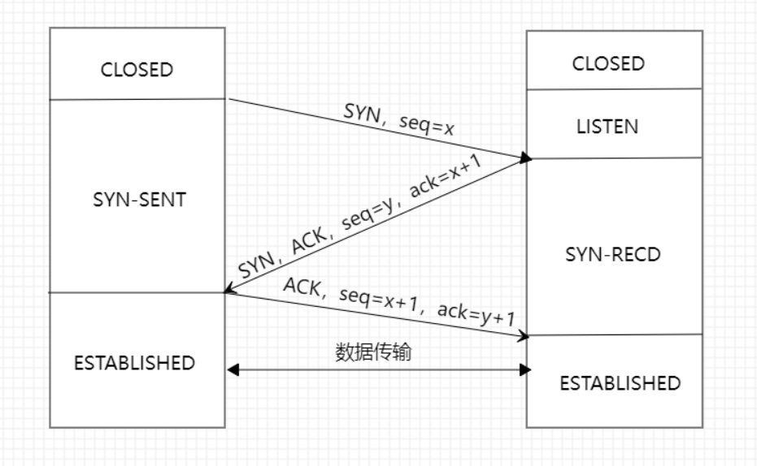
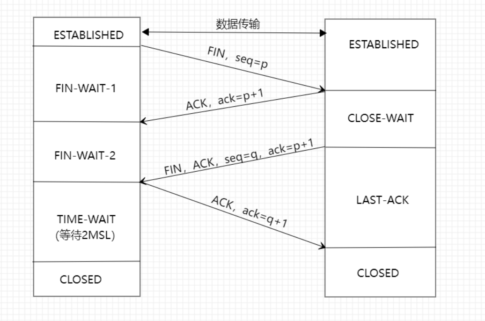

# TCP
**传输控制协议**（TCP）是一种面向连接的、可靠的、基于字节流的`传输层` 通信协议。 ——— *维基百科*
## TCP和UDP的区别
TCP的三大核心特性：
1. **面向连接**：客户端与服务端连接，双方通信之前，TCP需要三次握手建立连接。而UDP没有相应的建立连接的过程。
2. **可靠性**：TCP的可靠性体现在一是`有状态`，另一个是`可控制`。
    **有状态**体现在`TCP`会精确记录哪些数据发送，哪些数据被对方接收，哪些没有被接收，而且保证数据包按序到达，不允许有差错。
    **可控制**体现在当丢包或网络不佳时，`TCP`会根据具体情况调整发送速度或者重发。
    UDP就是`无状态`、`不可控`
3. **面向字节流**：`TCP`为了维护状态，将一个个IP包变成了字节流。`UDP`的数据传输是基于数据报的。

综上，TCP与UDP的区别：
**TCP是一个面向连接、可靠的、基于字节流的传输层协议，** 而**UDP是一个面向无连接的传输层协议。**

## TCP三次握手
`TCP`的三次握手，就是需要双方都确认的两样能力：`发送的能力`和`接收的能力`。

- 最开始双方都处于`CLOSED`状态。服务端开始监听某个端口，进入到`LISTEN`的状态。
- 客户端主动发起连接，发送`SYN`，自己变成`SYN-SENT`状态。
服务端收到，返回`SYN`和`ACK`（客户端的`SYN`），自己变成`SYN-REVD`状态。
- 客户端再次发送`ACK`给服务端，自己变成`ESTABLISHED`状态；服务端收到`ACK`后，也变成了`ESTABLISHED`状态。

#### 为什么不是两次握手？
因为两次握手无法确认客户端的接收能力。
如果发送的包**滞留**在当前网络中，TCP认为包已经丢失，就会重传，两次握手建立了连接。当关闭连接后，这个**滞留**在网络中的包到达了服务端，由于是两次握手，服务端只要接收到然后发送相应的数据包，就默认建立连接，但是现在客户端已经断开了。造成资源浪费。
#### 为什么不是四次握手？
三次握手已经足以确认双手都具有`发送`和`接收`的能力了，四次握手也可以，一百次握手也可以。但是三次握手就已经足够了。
#### 三次握手可以携带数据吗？
第三次握手的时候可以携带数据，前两次握手不可以携带数据。
如果前两次握手携带了数据，攻击者可以利用这个来攻击服务器。
第三次握手的时候客服端处于`ESTABLISHED`状态，并且服务端的接收、发送能力正常，相对安全，可以携带数据。

## TCP四次挥手

- 开始双方都处于`ESTABLISHED`状态。
- 客户端要断开连接，向服务端发送`FIN`,发送后，客服端变成`FIN-WAIT-1`状态，此时客户端不能向服务端发送报文，只能接收。
- 服务端接收后向客服端发送确认`ACK`，自己变成`CLOSE-WAIT`状态。
- 客户端收到确认，变成`FIN-WAIT-2`状态。
- 服务端向客服端发送`FIN`，自己进入`LAST-ACK`状态。
- 客服端收到服务端发送的`FIN`,变成`TIME-WAIT`状态，然后发送`ACK`给服务端。
这时候，客户端需要等待2个`MSL（Maximum Segment Lifetime，报文最大生存时间）`,在这段时间内如果客户端没有收到服务端的重发请求，那么表示`ACK`成功到达，挥手结束，否者客户端重新发送`ACK`。
#### 等待2MSL的意义
如果客户端不等待，服务端还有很多数据包要发送给客户端，而此时客户端刚好被新的应用所占用，就会收到很多无用的数据包，造成数据包混乱。所以还是等待服务端发来的数据包都死绝的时候再启动新的应用。
- 1个MSL确保四次挥手中ACK报文能达到对方端。
- 1个MSL确保对端没有收到ACK重传的FIN报文可以到达。

所以，需要等待2个MSL。
#### 为什么是四次挥手？
因为服务端在收到`FIN`时，往往不会立即返回`FIN`，必须等到服务端所有的报文都发送完毕，才能发`FIN`。所以先发一个`ACK`表示已经收到的客户端的`FIN`,等待一段时间后再发送`FIN`。

