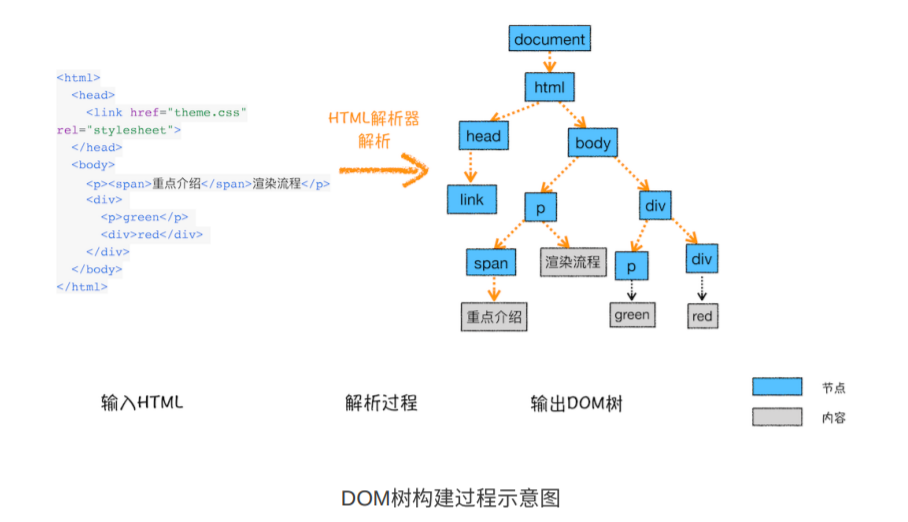
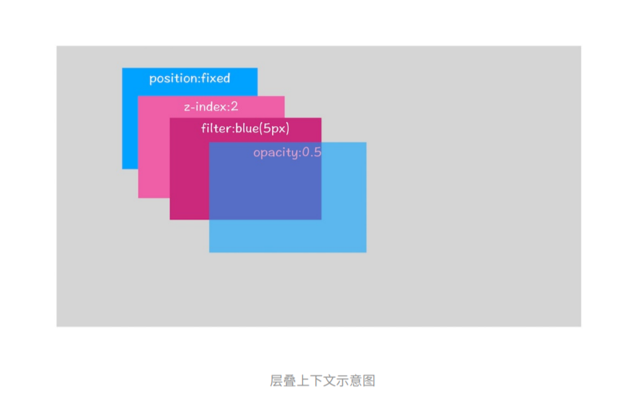

# 从输入URL到页面呈现的过程

可以说这是一个经常被问起的问题，同时也可以根据对这个问题的回答看出其对浏览器，网络的掌握情况。草草几行就把这个问题回答完，却不能道出其中的细节，很难让别人认为你彻底明白这其中发生的过程。所以更多细节上的学习对一个技术人来说是很重要的。

言归正传！！！

### 输入内容
当我们在浏览器的地址栏中输入内容时，首先地址栏会进行判断输入的是**搜索内容**还是**请求的URL**。当判断输入的内容符合**URL规则**,地址栏就很根据规则，把这段内容拼接成一个完整的URL。如输入`baidu.com`，就会拼接成`http://wwww.baidu.com`。

### 强缓存
接下来就会进入请求阶段，在发起请求之前，首先浏览器的网络进程会判断本地缓存是否缓存了资源，如果有缓存资源，那么就会将缓存资源返回，否则，进入网络请求流程。

### DNS
首先，我们输入的是一个域名，而数据包是通过`IP地址`传递的，所以，先会根据域名得到IP地址。这个过程需要依赖一个服务系统，这个系统将域名和IP一一映射，这个系统就叫**域名系统（DNS）**。这样我们就可以拿到域名对应的IP地址了。如果我们曾经用域名系统得到过其IP地址，那么浏览器就会将其IP地址缓存下来，下次我们就不要通过**DNS**再解析IP地址，直接走缓存。

### TCP连接
接下来根据IP地址和服务器建立TCP连接。建立连接后，浏览器端会构建请求行、请求头等信息，向服务器发送构建的请求信息。`Chrome`在同一个域名下最多只能有6个TCP连接，超过6个就需要排队等待。假设现在不需要等待，进入TCP连接阶段。
建立`TCP连接`需要经历三个阶段：
1. **三次握手**（即总共发送3个数据包确认建立连接）建立客服端和服务器的连接。
2. 进行数据传输。TCP的数据传输阶段，接收方接收到数据后必须要向对方发送`确认包`，如果没有发送`确认包`，就判定数据包丢失，并重新发送该数据包，保证数据准确到达。
3. **四次挥手**断开连接。
   
关于TCP的具体细节写在[TCP](TCP.md)这篇文章中

### 请求-响应
建立TCP连接后，即开始发送HTTP请求。浏览器发送HTTP请求要携带**请求行**、**请求头**、**请求体**，服务器在在收到请求后会生成响应数据（**响应行**、**响应头**、**响应体**等）。
如果响应行中返回了301或302那么就需要**重定向**，也就是服务器需要浏览器重定向到其他URL中，其中响应头的`location`字段会包含重定向的URL地址，然后再重新发起HTTP请求。
在响应的信息中包含了具体返回的是什么数据类型，通过`Content-Type`字段判断具体是什么类型。
返回了响应的数据之后也不是立刻就断开TCP连接，而是要根据响应头中的`Connection`字段，如果其字段是`Connection: keep-alive`，那么就表示这是个持久连接，这样TCP连接会一直保持，之后请求统一站点的资源会复用这个连接。否则，断开`TCP`连接，请求响应流程结束。

具体关于请求信息，响应头会返回什么信息写在[HTTP](HTTP.md)这篇文章中。

### 渲染阶段
在渲染进程中，将请求到的HTML，CSS，JavaScript渲染成页面。
默认情况下，Chrome会为每一个页面分配一个渲染进程，但是在同一个站点下的不同页面也会使用同一个渲染进程，也就是在一个页面中打开属于同一个站点的另一个页面。
解释一下什么是站点：
**根域名**（`baidu.com`）和**协议**(http/https)相同,还包含了该根域名下的所有子域名和不同的端口

    https://baidu.com
    https://www.baidu.com
    https://www.baidu.com:8080

渲染进程和网络进程之间形成**管道**，将网络进程中的数据进入到渲染进程中渲染。
首先先进行`解析`部分：
- 构建`DOM`树
- `样式`计算
- 生成`布局`树（`Layout Tree`）
  
#### 构建DOM树
因为浏览器无法直接理解和使用HTML，所以需要将HTML转换为浏览器能够理解的DOM树。

具体是怎么解析的呢？
HTML5规范详细的介绍了解析算法。这个算法分为两个阶段：
- 标记化
- 建树

对应的两个过程就是**词法分析**和**语法分析**
#### 样式计算
样式计算是为了计算出DOM节点中每个元素的具体样式

CSS样式的来源主要有三种：
- 通过**link**引用的外部CSS文件
- `<style>`标记内的CSS
- 元素的style属性内嵌的CSS

##### 格式化样式表
浏览器也是无法直接理解这些纯文本的CSS样式，所以将它转换为浏览器能够理解的结构——**styleSheets**

##### 标准化样式属性
有一些css样式属性的数值不容易被渲染引擎理解，所以将其转换为渲染引擎容易理解的、标准化的计算值。
如：
```css
body {
    font-size: 2em;
}
p {
    color: red;
}
div {
    font-weight: bold;
}
```
上面的`2em`、`red`、`blod`等不容易被理解的数值转为
```css
body {
    font-size: 32px;
}
p {
    color: rgb(255, 0, 0);
}
div {
    font-weight: 700;
}
```
可以看到`2em`被解析成了`32px`，`red`被解析成了`rgb(255,0,0)`，`bold`被解析成了`700`
##### 计算每个节点具体的样式
现在样式已经被`格式化`和`标准化`了，接下来就可以计算每个节点的样式了，计算方式有两个规则：**继承**和**层叠**

每个子节点都会默认继承父节点的样式属性，如果父节点中没有找到，就会采用浏览器默认样式`UserAgent`。

层叠规则，CSS最大的特点在于它的层叠规则，也就是最终的样式取决于各个属性共同作用的效果。

#### 生成布局树
现在已经有了`DOM树`和`DOM样式`，接下来需要确定元素的几何位置，生成**布局树**。
布局树生成的大致工作：
1. 遍历DOM树节点，添加到布局树中。
2. 计算布局树中节点的坐标位置。
   
布局树中只包含可见的节点，对于`head`和设置的`display:none`的元素，并不会包含其中。

至此，`解析`部分已经完成。
接下来进入`渲染`阶段：
- 建立`图层树`（`Layer Tree`）
- 图层绘制
- 合成和显示
  
##### 建图层树
渲染引擎给页面分了很多图层，这些图层按照一定顺序叠加在一起，形成了最终的页面。浏览器在构建完布局树之后，还会对特定的节点进行分层，构建一棵图层树(Layer Tree)。

通常情况下，并不是布局树的每个节点都包含⼀个图层，如果⼀个节点没有对应的层，那么这个节点就从属于⽗节点的图层。

那什么时候会提升为一个单独的合成层呢？

**一、 拥有层叠上下文的节点。**
层叠上下文也基本上是有一些特定的CSS属性创建的，一般有以下情况:

1. HTML根元素本身就具有层叠上下文。
2. 普通元素设置position不为static并且设置了z-index属性，会产生层3叠上下文。
3. 元素的 opacity 值不是 1
4. 元素的 transform 值不是 none
5. 元素的 filter 值不是 none
6. 元素的 isolation 值是isolate
7. will-change指定的属性值为上面任意一个。


从图中可以看出，明确定位属性的元素、定义透明属性的元素、使⽤CSS滤镜的元素等，都拥有层叠上下⽂属性。
**二、需要剪裁的地方。**
比如一个div，你只给他设置 100 * 100 像素的大小，而你在里面放了非常多的文字，那么超出的文字部分就需要被剪裁。当然如果出现了滚动条，那么滚动条会被单独提升为一个图层。

##### 图层绘制
渲染引擎实现图层的绘制会把⼀个图层的绘制拆分成很多⼩的绘制指令，然后再把这些指令按照顺序组成⼀个待绘制列表。

实际上渲染进程中绘制操作是由专门的线程来完成的，叫做**合成线程**

绘制列表准备好了之后，渲染进程的主线程会给`合成线程`发送`commit`消息，把绘制列表提交给`合成线程`。

首先，视口是有具体大小的，当页面非常大的时候，如果要一口气全部绘制出来是相当浪费性能的。因此，合成线程要做的第一件事就是分块。这些块通常是`256 * 256`或者`512 * 512`。这样可以大大加速页面的首屏展示。

渲染进程中专门维护了一个**栅格化线程池**，专门负责将**图块**转换为**位图数据**

因为后面图块数据要进入 GPU 内存，考虑到浏览器内存上传到 GPU 内存的操作比较慢，即使是绘制一部分图块，也可能会耗费大量时间。针对这个问题，Chrome 采用了一个策略: 在首次合成图块时只采用一个低分辨率的图片，这样首屏展示的时候只是展示出低分辨率的图片，这个时候继续进行合成操作，当正常的图块内容绘制完毕后，会将当前低分辨率的图块内容替换。这也是 Chrome 底层优化首屏加载速度的一个手段。

然后合成线程会选择视口附近的**图块**，把它交给**栅格化线程池**生成位图。

生成位图的过程实际上都会使用 GPU 进行加速，生成的位图最后发送给`合成线程`。

##### 合成和显示
栅格化操作完成后，合成线程会生成一个绘制命令，即"DrawQuad"，并发送给浏览器进程。

浏览器进程中的viz组件接收到这个命令，根据这个命令，把页面内容绘制到内存，也就是生成了页面，然后把这部分内存发送给显卡。为什么发给显卡呢？我想有必要先聊一聊显示器显示图像的原理。

无论是 PC 显示器还是手机屏幕，都有一个固定的刷新频率，一般是 60 HZ，即 60 帧，也就是一秒更新 60 张图片，一张图片停留的时间约为 16.7 ms。而每次更新的图片都来自显卡的前缓冲区。而显卡接收到浏览器进程传来的页面后，会合成相应的图像，并将图像保存到后缓冲区，然后系统自动将前缓冲区和后缓冲区对换位置，如此循环更新。

看到这里你也就是明白，当某个动画大量占用内存的时候，浏览器生成图像的时候会变慢，图像传送给显卡就会不及时，而显示器还是以不变的频率刷新，因此会出现卡顿，也就是明显的掉帧现象。

至此，从输入URL到页面呈现的过程以及其中的细节已经全部描述完毕，现在我们来整理一下：

1. 输入URL，首先查看浏览是否有缓存，如果有的话，直接从缓存读取资源。
2. 没有缓存，DNS解析IP地址，根据IP地址与服务器建立TCP连接。
3. 发送HTTTP请求，服务器做出响应，如果返回301或302，那么需要重定向，再次向重定向的地址发起HTTP请求。当响应头的`Content-Type: text/html`，代表返回的是HTML文件，进入解析和渲染阶段。
4. 解析阶段，浏览器将HTML文件转换为DOM树，并根据CSS文件转换的`styleSheets`结构计算出每个节点的样式，之后遍历DOM树，计算每个节点的几何位置，构建布局树，布局树中只有可见的节点。
5. 接下来进入渲染阶段，首先根据特定的节点进行分层，构建一颗图层树。
6. 对图层进行渲染，渲染引擎会将图层的绘制拆分为一些绘制指令，将这些绘制指令按照顺序组成一个绘制列表。
7. 浏览器的渲染进程的主线程会将绘制操作交给合成线程，将图层分为一个一个的图块，渲染进程中有一个专门将图块转为位图的栅格化线程池，合成线程就会调用栅格化线程池拿到位图。
8. 之后合成线程会发给浏览器进程一个绘制命令，浏览器进程根据这个命令，把页面内面内容绘制到内存中，最后再将内存显示在屏幕上。
9. 渲染结束后，如果响应头的`Connection`为：`keep-alive`，那么表示是一个持久连接，如果不是，则断开连接。请求-响应结束。