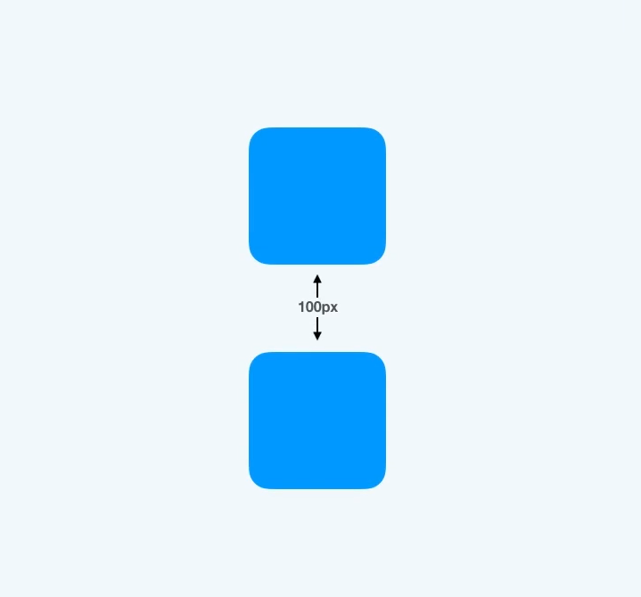
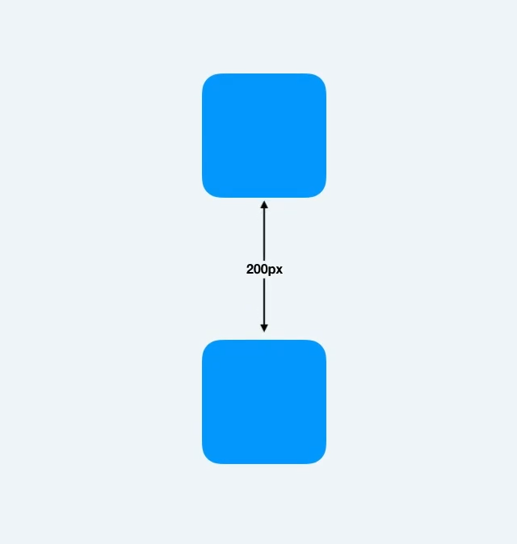
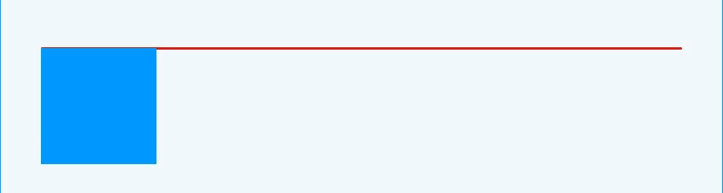
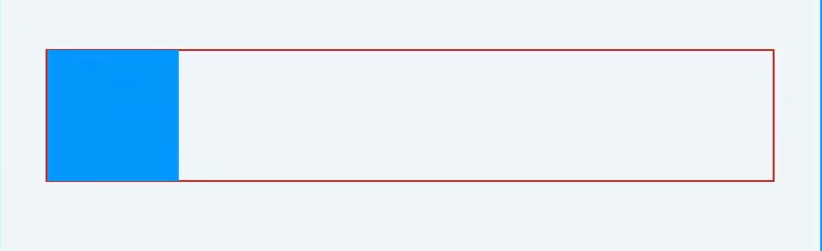
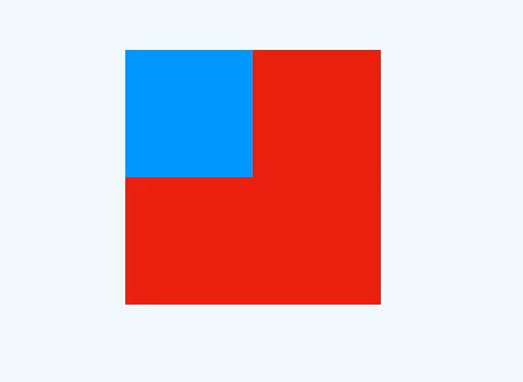
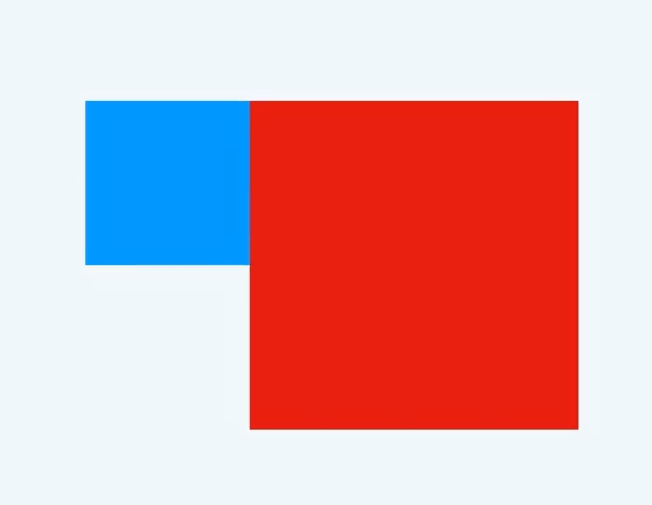

# BFC
## 什么是BFC？
> W3C对BFC的定义如下： 浮动元素和绝对定位元素，非块级盒子的块级容器（例如 inline-blocks, table-cells, 和 table-captions），以及overflow值不为"visiable"的块级盒子，都会为他们的内容创建新的BFC（Block Fromatting Context， 即块级格式上下文）。

BFC可以理解为一个元素创建的BFC，那么它就是一个独立的容器，容器内有自己的布局规则，且不会影响的外面元素的布局。
## 如何触发BFC
1. 根元素（`<html>`）
2. 浮动元素（元素的`float`不是`none`）
3. 绝对定位元素（元素的`position`为`absolute`或`fixed`）
4. 行内块元素（元素的`display`为`inline-block`）
5. 表格单元格（元素的`display`为`table-cell`,HTML表格单元格默认为该值）
6. 表格标题（元素的`display`为`table-caption`,HTML表格标题默认为该值）
7. 匿名表格单元格元素（元素的`display`为`table`、`table-row`、`table-row-group`、`table-header-group`、`table-footer-group`(分别为HTML `table`、`row`、`tbody`、`thead`、`tfoot`的默认属性)或`inline-table`）
8. overflow值不为`visible`的块元素
9. 网格元素（`display`为`grid`或`inline-grid`元素的直接子元素）
## BFC的布局规则
- BFC垂直方向边距重叠
- BFC的区域不会与浮动元素的box重叠
- BFC是一个独立的容器，外面的元素不会影响里面的元素
- 计算BFC的高度时，浮动元素也参与计算高度
## BFC的作用
1. **避免外边距重叠**

```html
<div class="cube"></div>
<div class="cube"></div>
```
```css
.cube{
    width: 100px;
    height: 100px;
    background: blue;
    margin: 100px;
}
```

两个外边距都为100px的两个box，实际上两个box的中间距离并不是200px。而是100px，这是因为**块的上外边距`margin-top`和下外边距`margin-bottom`会合并为单个边距，其大小为单个边距的最大值，如果两个值相等，则仅为其中一个**，这就是外边距重叠现象。

解决办法：利用BFC
将两个box放置在不同的`container`中，利用`overflow:hidden`触发`container`的BFC。
```html
<div class="container">    
    <div class="cube"></div>
</div>
<div class="container">
    <div class="cube"></div>
</div>
```

```css
.container{
    overflow: hidden;
}
.cube{
    width: 100px;
    height: 100px;
    background: blue;
    margin: 100px;
}
```


2. **清除浮动**
防止浮动导致父元素高度塌陷
```html
<div class="container">    
    <div class="cube"></div>
</div>
```
```css
.container{
    border: 1px solid red;
}
.cube{
    width: 100px;
    height: 100px;
    background: blue;
    float: left;
}
```

因为我们对子元素添加了浮动，使它脱离了文档流，所以只剩下2px的边距高度。
通过`overflow: hidden`属性触发父容器的BFC，父容器将包裹着子容器，达到了清除浮动的作用
```css
.container{
    border: 1px solid red;
    overflow: hidden;
}
.cube{
    width: 100px;
    height: 100px;
    background: blue;
    float: left;
}
```


3. **防止元素被浮动元素覆盖**
```html
<div class="floatDiv"></div>
<div class="normalDiv"></div>
```
```css
.floatDiv{
    width: 100px;
    height: 100px;
    background-color: blue;
    float: left;
}
.normalDiv{
    width: 200px;
    height: 200px;
    background-color: red;
}
```

可以看到，设置了浮动的元素覆盖了没有设置浮动的元素。如果想要避免覆盖可以触发`正常元素`的BFC属性。
```css
.normalDiv{
    width: 200px;
    height: 200px;
    background-color: red;
    overflow: hidden;
}
```


