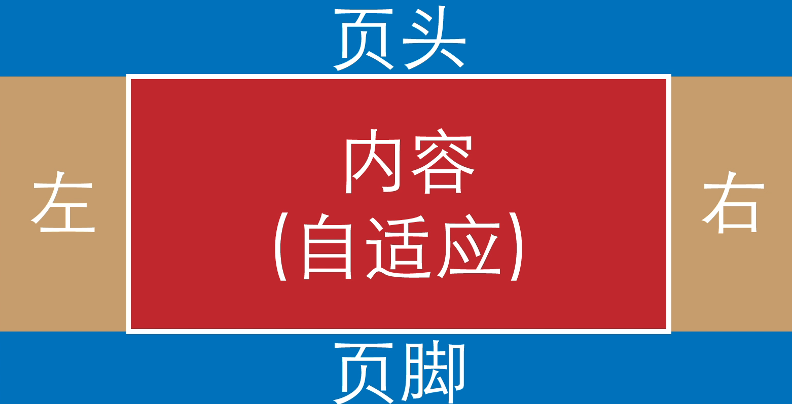

# css布局

## 圣杯布局

左右宽度固定，中间宽度自适应
1. 利用flex
```html
<!DOCTYPE html>
<html lang="en">
<head>
	<meta charset="UTF-8">
	<title>Document</title>
	<style>
    *{
      margin: 0;
      padding: 0;
    }
    .header,
    .footer {
      height: 40px;
      width: 100%;
      background: red;
    }
    .container{
      overflow: hidden;
    }

    .middle {
      background: yellow;
    }

    .left {
      float: left;
      width: 200px;
      background: pink;
    }

    .right {
      float: right;
      width: 250px;
      background: aqua;
    }
	</style>
</head>
<body>
    <div class="header">这里是头部</div>
    <div class="container">
        <div class="left">左边</div>
        <div class="middle">中间部分</div>
        <div class="right">右边</div>
    </div>
    <div class="footer">这里是底部</div>
</body>
</html>
```
2. 利用浮动
```html
<!DOCTYPE html>
<html lang="en">

<head>
  <meta charset="UTF-8">
  <title>Document</title>
  <style>
    *{
      margin: 0;
      padding: 0;
    }
    .header,
    .footer {
      height: 40px;
      width: 100%;
      background: red;
    }
    .container{
      overflow: hidden;
    }

    .middle {
      background: yellow;
    }

    .left {
      float: left;
      width: 200px;
      background: pink;
    }

    .right {
      float: right;
      width: 250px;
      background: aqua;
    }
  </style>
</head>

<body>
  <div class="header">这里是头部</div>
  <div class="container">
    <div class="left">左边</div>
    <div class="right">右边</div>
    <div class="middle">中间部分</div>
  </div>
  <div class="footer">这里是底部</div>
</body>

</html>
```
## 双飞翼布局
```html
<!DOCTYPE html>
<html lang="en">

<head>
  <meta charset="UTF-8">
  <meta name="viewport" content="width=device-width, initial-scale=1.0">
  <meta http-equiv="X-UA-Compatible" content="ie=edge">
  <title>Document</title>
  <style>
    *{
      margin: 0;
      padding: 0;
    }
    .container {
        min-width: 600px;
    }
    .left {
        float: left;
        width: 200px;
        height: 400px;
        background: red;
        margin-left: -100%;
    }
    .center {
        float: left;
        width: 100%;
        height: 500px;
        background: yellow;
    }
    .center .inner {
        margin: 0 200px; 
    }
    .right {
        float: left;
        width: 200px;
        height: 400px;
        background: blue;
        margin-left: -200px;
    }
  </style>
</head>

<body>
  <article class="container">
    <div class="center">
        <div class="inner">双飞翼布局</div>
    </div>
    <div class="left"></div>
    <div class="right"></div>
</article>
</body>

</html>
```


## 左侧固定，右侧自适应
### 固定区域浮动，自适应区域不设置宽度但设置margin
```html
<div class="box">
    <div class="left">left</div>
    <div class="right">right</div>
</div>
```
```css
.box{
    overflow:hidden
}
.left{
    float: left;
    width: 200px;
    height: 200px;
    background-color: grey;
}
.right{
    margin-left: 200px;
    height: 200px;
    background-color: lightgrey;
}
```
### 固定区域使用定位，自适应区域不设置宽度但设置margin
```html
<div class="box">
    <div class="left">left</div>
    <div class="right">right</div>
</div>
```
```css
.box{
    position: relative;
}
.left{
    position: absolute;
    top: 0;
    left: 0;
    width: 200px;
    height: 200px;
    background-color: grey;
}    
.right{
    height: 200px;
    margin-left: 200px;
    background-color: lightgrey;
}
```