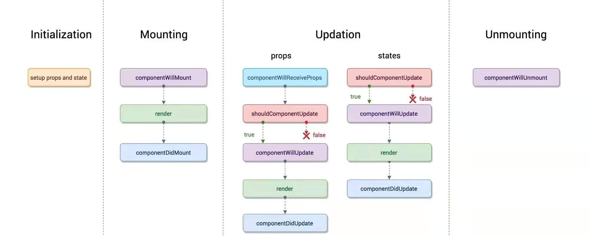

# React

## React事件
在react中，我们绑定的事件，并不是绑定在`dom`上，而是绑定在`docuement`上，而react上事件，并不是原生事件，而是由原生事件合成的`react事件`。

比如，`click`事件合成为`onClick`事件，`blur`、`change`、`input`、`keyup`、`keydown`合成为`onChange`事件。

react采用合成事件的原因：

- 将事件绑定在`document`上同一管理，防止事件绑定在`dom`上造成不可控的情况。
- 实现所有浏览器一致的事件系统，抹平不同浏览器的差异。

## class Component生命周期

- 初始化阶段
```
在constructor中进行state、props的初始化，这个阶段对state的赋值，不会执行更新阶段的生命周期
```
- 挂载阶段
```html
1. componentWillMount
    发生在render函数之前，还没有挂载DOM
2. render
3. componentDidMount
    发生在render函数后，已经挂载DOM
```
- 更新阶段
```html
props更新时：
1. componentWillReceiveProps(nextProps,nextState)
    这个生命周期主要是对props发生变化的监听。
    如需要在props发生改变后相应的改变组件的一些state。
    这个方法中state会直接合并，不会发生二次渲染。
2. shouldComponentUpdata(nextProps,nextState)
    返回一个Boolean值，判断是否需要更新渲染组件
    不可以setState()，会导致循环调用
3. componentWillUpdata(nextProps,nextState)
    处理DOM发生更新之前的事情
    不可以setState()，会导致循环调用
4. render
5. componentDidUpdata(prevProps,prevState)
    此时渲染已经完成，DOM已经发生变化，state已经更新
    prevProps和prevState均为上一个状态的值

state更新时同上
1. shouldComponentUpdata
2. componentWillUpdata
3. render
4. componentDidUpdata
```
- 卸载阶段
```html
componentWillUnmount
    在组件卸载和销毁之前调用
```



在React16中，以下三个钩子函数已经被删除

    componentWillMount
    componentWillReceiveProps
    componentWillUpdata

取而代之的是
```js
static getDerivedStateFromProps(nextProps,nextState)
    在组件实例化、接收到新的props、组件状态更新时会被调用
getSnapshotBeforeUpdate
    在这个阶段我们可以拿到上一个状态 Dom 元素的坐标、大小的等相关信息。用于替代旧的生命周期中的 componentWillUpdate。
    该函数的返回值将会作为 componentDidUpdate 的第三个参数出现。
```


